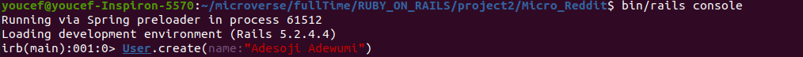
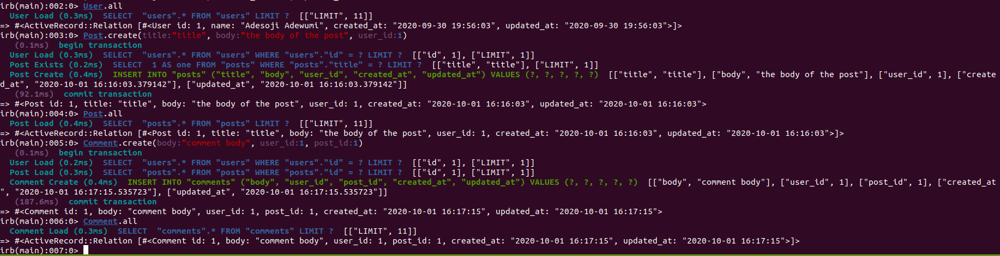

# Micro Reddit

In this project, we have created a Micro version of [Reddit](https://www.reddit.com/) using:

- Ruby on Rails
- Model validations
- Active Record

## Setup

- Have Ruby 2.7.0 installed (to check if it is installed you can run: ruby -version in your console);
- Have rails 5.x.x installed (to check if it is installed you can run: rails -v in your console to check);
- Clone this [repository](https://github.com/ABDELLANI-Youcef/Micro_Reddit) to your loal machine;
- Go to the root directory of the cloned project;
- Run the next command : "bundle install" in order to setup the dependencies of project.
- Run the database migration using this command: "bin/rails db:migrate"

## How to use the application

In this application we use only models of the users, posts and comments. Every user can make as many posts as he wants. The user can also make as many comments as he wants on a particular post. The post belongs to only one user and can have many comments and comment belongs to only one post and only one user.

This application runs in console so you should start the rails console by running this command: bin/rails console

To create a new user :
User.create(name:"xxxx")

To check all the users created:
User.all

To create a post :
Post.create(title:"XXXX", body:"YYYY", user_id:integer)
For user_id you should add an integer like 1, 2 or 3... which represent the id of the user that created the post.

To check all the posts created:
Post.all

To create a comment:
Comment.create(body:"comment text", user_id:integer, post_id: integer )
For user_id you should add an integer like 1, 2 or 3... which represent the id of the user that wrote the comment.
For post_id you should add an integer like 1, 2 or 3... which represent the id of the post concerned by the comment.

To check all the comments created:
Comment.all

## Built With

- Code editor: VsCode
- Language: Ruby on Rails
- Linters: Rubocop

### Prerequisites

- Browser (Google Chrome, Mozilla Firefox, Safari or any other browser)

## Authors

👤 **Youcef Abdellani**

- Github: [@ABDELLANI-Youcef](https://github.com/ABDELLANI-Youcef)
- Twitter: [@YoucefAbdellani](https://twitter.com/YoucefAbdellani)
- Linkedin: [linkedin](https://www.linkedin.com/in/youcef-abdellani/) 

👤 **Jurgen Clausen Gutierrez**

- Github: [@AdesojiCodeMaster](https://github.com/AdesojiCodeMaster)
- Twitter: [@codemas22665735](https://twitter.com/codemas22665735)
- Linkedin: [linkedin](https://www.linkedin.com/in/adesoji-adewumi-7752aba5) 

## 🤝 Contributing

Contributions, issues and feature requests are welcome!

Feel free to check the [issues page](https://github.com/ABDELLANI-Youcef/Micro_Reddit.git).

## Show your support

Give a ⭐️ if you like this project!

## Acknowledgments

- Microverse
- GitHub
- TheOdinProject
- Ruby

## 📝 License

This project is [MIT](lic.url) licensed.
